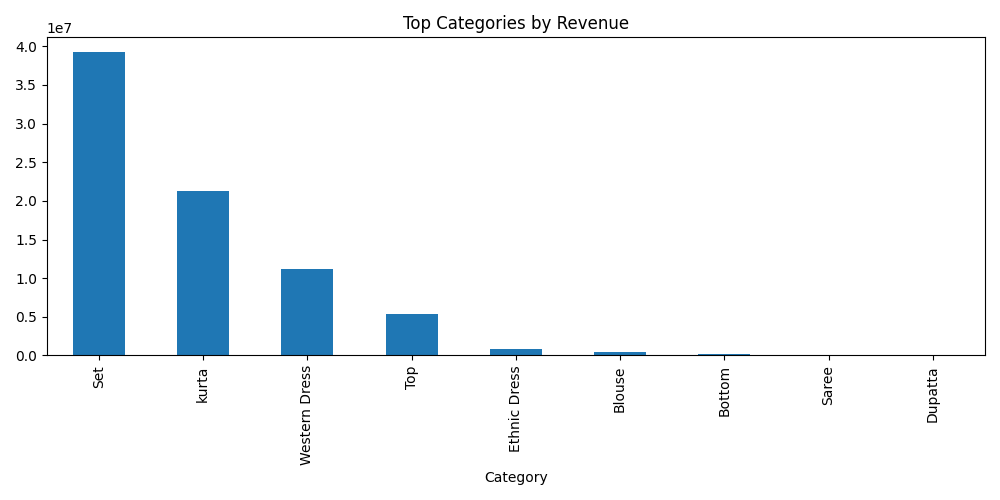
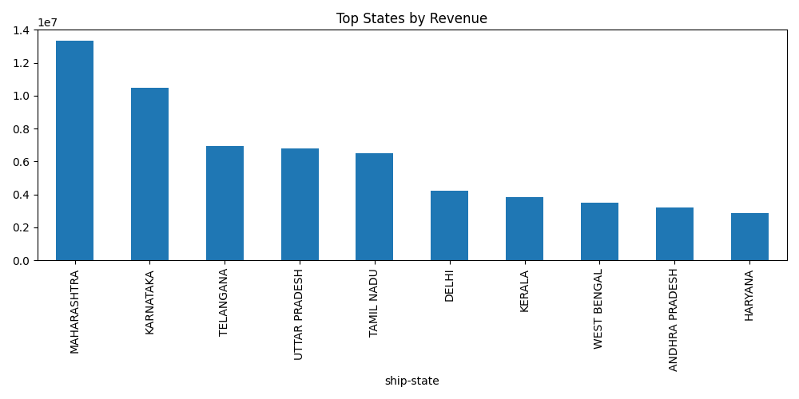

# Amazon Sales Analytics Dashboard

## Project Overview

This project analyzes Amazon sales data using Python and Pandas.

The objective is to clean raw sales records, generate business insights, create visualizations, and automate reporting.

## Technologies Used

* Python
* Pandas
* NumPy
* Matplotlib
* OpenPyXL
* Git
* GitHub

## Dataset Information

* Dataset: Amazon Sale Report
* Records: 128,000+
* Industry: E-Commerce
* Analysis Type: Sales Analytics

## Business Questions Answered

* Which product categories generate the highest revenue?
* Which states contribute the most sales?
* What is the order status distribution?
* Which business areas need improvement?

## Results

* Analyzed 128,000+ Amazon sales records
* Identified top-performing product categories
* Analyzed sales distribution across states
* Examined order fulfillment status patterns
* Generated automated Excel reports

## Visualizations

### Sales by Category



### Sales by State



## Project Outputs

* Excel Sales Report
* Category Analysis
* State Analysis
* Order Status Analysis
* Data Visualizations

## Skills Demonstrated

* Data Cleaning
* Exploratory Data Analysis (EDA)
* Data Visualization
* Business Reporting
* Python Automation
* Git Version Control

## Future Improvements

* Monthly Sales Trend Analysis
* SQL Integration
* Power BI Dashboard
* Customer Segmentation
* Sales Forecasting

## How to Run

1. Install dependencies

```bash
pip install -r requirements.txt
```

2. Run the project

```bash
python sales_analysis.py
```
